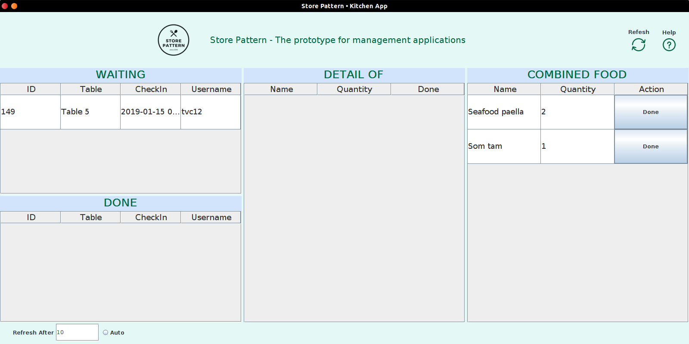

<h1 align="center" id="home">
  <a href="https://github.com/jade28/store-pattern">
    
  </a>
  <br>Store Pattern<br>
</h1>

<h4 align="center">
  👑 The prototype for management applications.
</h4>

<p align="center">
  <a href="https://travis-ci.org/jade28/store-pattern">
    
  </a>
  
   <a href="#">
    
  </a>
  
   <a href="#">
    
  </a>
  
  <a href="#">
    
  </a>
  
  <a href="https://github.com/jade28/store-pattern/blob/master/LICENSE">
    
  </a>
  
  <a href="https://github.com/jade28/store-pattern/blob/master/LICENSE">
    
  </a>
</p>  

<div align="center">
  <h4>
    <a href="#features">Features</a> |
    <a href="#structure">Structure</a> |
    <a href="#install">Install</a> |
    <a href="#usage">Usage</a> |
    <a href="#documents">Documents</a> |
    <a href="#technologies">Technologies</a> |
    <a href="#some-screens">Some Screens</a> |
    <a href="#bugs-and-issues">Bugs and Issues</a> |
    <a href="#team">Team</a> |
    <a href="#license">License</a>
  </h4>
</div>

## Features

* Ordering foods by table.
* Checkout, preview & print invoice.
* Profile feature.
* Manage food & category.
* Manage table.
* Manage account.
* Sales report.

## Structure

<p align="center">

</p>

## Install

Clone this project:
```
$ git clone https://github.com/jade28/store-pattern.git
```
cd `store-pattern`:
```
$ cd store-pattern
```
Install packages for `flutter` apps:
```
$ flutter packages get
```

## Usage

Using this account for testing:</br>
**`username`**: `test`</br>
**`password`**: `test`</br>

Enjoy 👍

## Documents

For help getting started with Flutter, view our online [documentation](https://flutter.io/).

## Technologies

* [Flutter](https://flutter.io/)
* [Java](https://www.java.com/en/download/)
* [PHP](http://php.net/)
* [MySQL](https://www.mysql.com/)

## Some Screens

### `Order App`

<div style="text-align: center"><table><tr>
  <td style="text-align: center">
  <a href="https://github.com/jade28/store-pattern/tree/master/order_app">
    </a>
</td>
<td style="text-align: center">
  <a href="https://github.com/jade28/store-pattern/tree/master/order_app">

  </a>
</td>
<td style="text-align: center">
  <a href="https://github.com/jade28/store-pattern/tree/master/order_app">

  </a>
</td>
<td style="text-align: center">
  <a href="https://github.com/jade28/store-pattern/tree/master/order_app">

  </a>
</td>
</tr></table></div>

<div style="text-align: center"><table><tr>
<td style="text-align: center">
  <a href="https://github.com/jade28/store-pattern/tree/master/order_app">

  </a>
</td>
<td style="text-align: center">
<a href="https://github.com/jade28/store-pattern/tree/master/order_app">
  </a>
</td>
<td style="text-align: center">
  <a href="https://github.com/jade28/store-pattern/tree/master/order_app">

  </a>
</td>
<td style="text-align: center">
  <a href="https://github.com/jade28/store-pattern/tree/master/order_app">

  </a>
</td>

</tr></table></div>

### `Admin App`

<div style="text-align: center"><table><tr>
  <td style="text-align: center">
  <a href="https://github.com/jade28/store-pattern/tree/master/admin_app">
    </a>
</td>
<td style="text-align: center">
  <a href="https://github.com/jade28/store-pattern/tree/master/admin_app">

  </a>
</td>
<td style="text-align: center">
  <a href="https://github.com/jade28/store-pattern/tree/master/admin_app">

  </a>
</td>
<td style="text-align: center">
  <a href="https://github.com/jade28/store-pattern/tree/master/admin_app">

  </a>
</td>
</tr></table></div>

<div style="text-align: center"><table><tr>
<td style="text-align: center">
  <a href="https://github.com/jade28/store-pattern/tree/master/admin_app">

  </a>
</td>
<td style="text-align: center">
<a href="https://github.com/jade28/store-pattern/tree/master/admin_app">
  </a>
</td>
<td style="text-align: center">
  <a href="https://github.com/jade28/store-pattern/tree/master/admin_app">

  </a>
</td>
<td style="text-align: center">
  <a href="https://github.com/jade28/store-pattern/tree/master/admin_app">

  </a>
</td>

</tr></table></div>

### `Kitchen App`

 <a href="https://github.com/jade28/store-pattern/tree/master/kitchen_app">

  </a>

## Bugs and Issues

Have a bug or an issue with this project? [Open a new issue](https://github.com/jade28/store-management/issues) here on GitHub.

## Team

| [](https://github.com/jade28) | [](https://github.com/tvc12) | [](https://github.com/lhthang1998) |
| :---: | :---: | :---: |
| [Cuong Nguyen](https://github.com/jade28) | [Thien Chi Vi](https://github.com/tvc12) | [Thang Huu Le](https://github.com/lhthang1998) |

**[⬆ back to top](#home)**

## License

MIT © [jade28](https://github.com/jade28) 🐢
